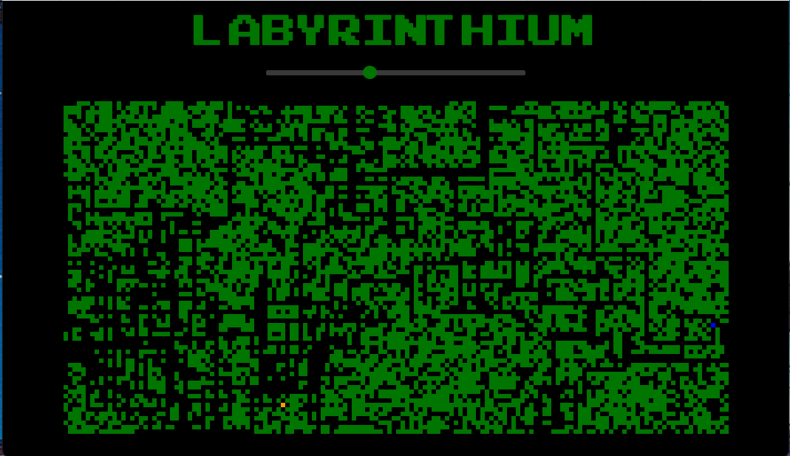

# Labyrinthium

A simple maze game built with Typescript and Svelte and deployed [here](https://n-ckr-ch-rds-n.github.io/labyrinthium/). You are the blue square. Make your way to the orange square using the arrow keys. When you arrive at the orange square a new maze will be generated for you. The slider at the top of the maze controls the complexity of the maze. That's it.

## Local development

- Download repo and `cd` into it
- Install dependencies: `npm install`
- Run dev server: `npm run dev`
